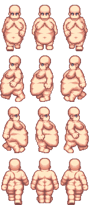

# Flash Back To The Future

## Synopsis

You are an adventurer that is searching the 5 86 of infinity.

You will start in a village where a magician will bring you into a flashback.

In this flashback your quest for 86 start and you will meet some villagers and monsters.

You will gain XP during all the game by killing mobs and will upgrade your stats.

Enjoy your adventure.

The amazing RPG
The Best RPG

## Made by:

- **Romain PANNO** : [link](https://github.com/romainpanno).
- **Xavier MITAULT** : [link](https://github.com/Saverio976).
- **Guillaume ABEL** : [link](https://github.com/guillaumeAbel).
- **Brice DE SOUSA** : [link](https://github.com/KitetsuK).

# SPRITES

https://cooltext.com/Logo-Design-White

https://cooltext.com/Logo-Design-Epic-Stone

## LINK

__true link__

## MAPS

lot of map
[map-folder](/assets/image/map/squares/)

## ENNEMY

### used
- amongus

- hob

- warrior

- boss nico

- boss sans

- boss spider

- dark ennemy

- pinguin

-forest people

